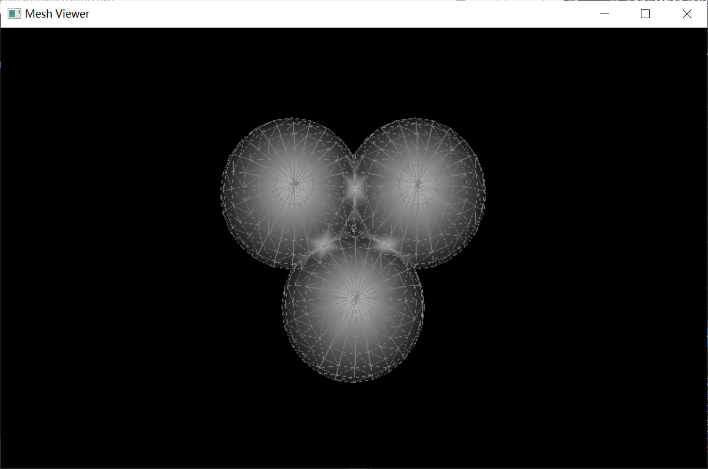

# MeshSimplification

This is an implementation of the mesh simplification algorithm using quadric error metrics, which is a simple case (Simplification of geometry) in the work of [Hugues Hoppe](http://hhoppe.com/newqem.pdf). A visualization system including simple keyboard interface is also implemented based on OpenGL. It takes about 40 seconds to work on meshes with 2500 vertices.

### Implementation Detail

For each face $f$ of the original mesh, a quadric $Q^{f}(\mathbf{v})$ can be defined as the squared distance of a point $v$ to the plane to which $f$ belongs. Suppose $f$ is consisted of three vertices $(\mathbf{v}_1, \mathbf{v}_2, \mathbf{v}_3)$, this quadric can be written as 

$$Q^{f}(\mathbf{v}) = [\mathbf{n}^T (\mathbf{v} - \mathbf{v}_1)]^2 = \mathbf{v}^{T}\left(\mathbf{n} \mathbf{n}^{T}\right) \mathbf{v}+2 d \mathbf{n}^{T} \mathbf{v}+d^{2}$$

where $\mathbf{n}$ is the face normal of $f$ and $d=-\mathbf{n}^{T} \mathbf{v}_{1}$ .

Each vertex v of the original mesh is assigned the sum of quadrics on its adjacent faces weighted by face area:

$Q^{v}(\mathbf{v})=\sum_{f \ni v} \operatorname{area}(f) \cdot Q^{f}(\mathbf{v})$

After each edge collapse $(v_1, v_2) \rightarrow v$ , the new position of $v$ should minimize the two quadrics related to $v_1$ and $v_2$.  This minimum can be easily obtained by solving the linear system: $\nabla Q^{\nu}(\mathbf{v}) = 0$

 By iterating over all edges of original mesh, we can select the edge that leads to the lowest minimum as the next edge for collapse.

### Usage 

**Keyboard Interface**

* **F1** : read file "../meshes/Bunny.obj"
* **F2** : read file "../meshes/Bunny_head.obj"
* **F3** : read file "../meshes/Balls.obj"
* **F4** : select display mode, switch among "flat", "wire" and "flat-wire"
* **SHIFT** : start to simplify current mesh, enter the target number of vertices as prompted by the console
* **F5** : choose which mesh to show, switch between original mesh (read from file) and current mesh

**Mouse Interface**

* Wheel Up/Down : Zoom Out/In
* Left Mouse : camera rotation

### Compile

**IDE**: Visual Studio 2017

**3rd party library required:** OpenGL, [Eigen3.3.7](http://eigen.tuxfamily.org/index.php?title=Main_Page), [freeglut 3.2.1](http://freeglut.sourceforge.net/index.php#download), [OpenMesh 8.0](https://www.openmesh.org/download/)

(OpenMesh is complied from source code, only OpenMeshCore and OpenMeshTools need to be installed)

Support compiling with **CMake**. Path to external library may need to be modified in CMakeList.

### Results

    
    <figcaption> Information displayed by self-defined control panel </figcaption>

#### Example 1 : Stanford Bunny

    
  	
    <figcaption> Original Bunny mesh (2503 vertices); Left : flat mode; Right : wire mode </figcaption>

  	

    
  	
    <figcaption> Simplified Bunny mesh (1000 vertices); Left : flat mode; Right : wire mode </figcaption>

  

    
  	
    <figcaption> Simplified Bunny mesh (500 vertices); Left : flat mode; Right : wire mode </figcaption>

  

    
  	
    <figcaption> Simplified Bunny mesh (250 vertices); Left : flat mode; Right : wire mode </figcaption>

  

#### Example 2 : Bunny Head 

    
  	
    <figcaption> Original Bunny mesh (741 vertices); Left : flat mode; Right : wire mode </figcaption>

    
  	
    <figcaption> Simplified Bunny mesh (370 vertices); Left : flat mode; Right : wire mode </figcaption>

    
  	
    <figcaption> Simplified Bunny mesh (135 vertices); Left : flat mode; Right : wire mode </figcaption>

    
  	
    <figcaption> Simplified Bunny mesh (741 vertices); Left : flat mode; Right : wire mode </figcaption>

#### Example 3 : 3 balls

    
  	
    
    
    <figcaption> UpperLeft: Original 3balls model(547 vertices); UpperRight: Simplified model (270 vertices); LowerLeft: simplified model (135 vertices); LowerRight: simplified model (70 vertices) </figcaption>

